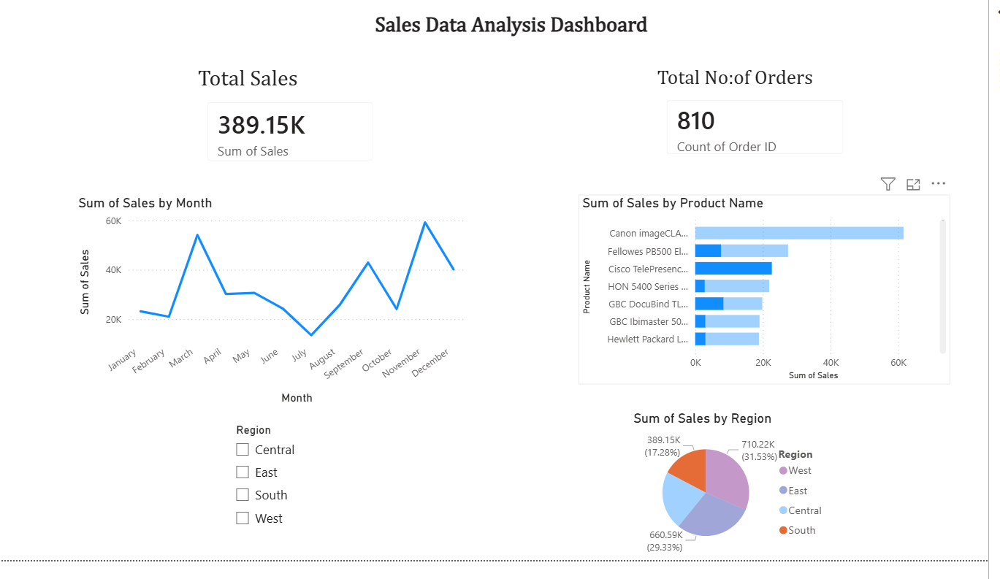

# Sales Data Analysis Dashboard

## Tools Used
- Python (Pandas)
- SQL
- Power BI

## Project Description
This project analyzes sales data to identify trends and generate insights.

## Key Insights
- Sales vary across months
- Top products identified
- Region-wise performance analyzed

## Files Included
- analysis.py (Python code)
- cleaned_sales_data.csv
- sales_dashboard.pbix
- dashboard.png

## Dashboard Preview

